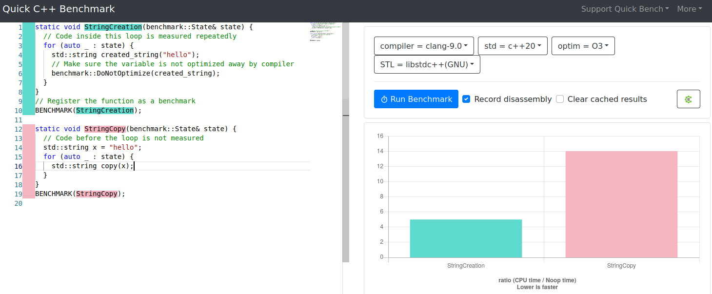

# CPP Optimizations Diary

Optimizing code in C++ is something that no one can resist. You can have fun
and pretend  that you are doing something useful for your organization at the same time!

In this repository, I will record some simple design patterns to improve your code 
and remove unnecessary overhead in **C++**.

If you are a seasoned C++ expert, you probably have already a set of rules in your head
that you always follow.

These rules help you look like a bad-ass/rockstar/10X engineer to your colleagues.

You are the kind of person that casually drops a `std::vector<>::reserve` before a loop and
nods smiling, looking at the perfomance improvement and the astonishment of your team member.

Hopefully, the examples in this repository will help you achieve this status of guru
and, as a side effect, save the planet from global warning, sparing useless CPU
cycles from being wasted.

Then, of course, someone on the other side of the planet will start mining Bitcoins or write her/his 
application in **Python** and all your effort to save electricity was for nothing.

I am kidding, Python developers, we love you!

> Narrator: "he was not kidding..."

## Rule 1: measure first (using _good_ tools)

The very first thing any person concerned about perfomance should do is:
 
- **Measure first** and **make hypothesis later**.

Me and my colleagues are almost always wrong about the reasons a piece of code is
be slow. 

Sometimes we are right, but it is really hard to know in advance ho refactoring will
improve performance. Good profiling tools show in minutes the "low hanging fruits": minimum work, maximum benefit!

Summarizing: 10 Minutes profiling can save you hours of work guessing and refactoring.

My "goto" tools in Linux are [Hotspot](https://github.com/KDAB/hotspot) and 
[Heaptrack](https://github.com/KDE/heaptrack). I understand Windows has similar
tools too.

In the benchmark war, if you are the soldier, these are your rifle and hand granades.

Once you know which part of the code deserves to be optimized, you might want to use
[Google Benchmark](https://github.com/google/benchmark) to measure the time spent in a very specific
class or function.

You can even run it Google Benchmark online here: [quick-bench.com](http://quick-bench.com/G7B2w0xPUWgOVvuzI7unES6cU4w).

## Rule 2: learn good design patterns, use them by default

Writing good code is like brushing your teeth: you should do it without thinking too much about it.

It is a muscle that you need to train, that will become stronger over time. But don't worry:
once you start, you will start seeing recurring patterns that 
are surprisingly simple and works in many different use cases.

**Spoiler alert**: one of my most beloved tricks is to _minimize the number of heap allocations_.
You have no idea how much that helps.

But I am getting ahead of myself...

# Optimization examples

## "If you pass that by value one more time, I swear to god that..."

TODO

- Const reference by default.

- Move semantic and return value optimization.

## std::vector<> is your best friend

TODO

- [Use std::vector<>::reserve by default](vectors_everywhere/reserve)

- ["I have learnt linked-lists at university, should I use them?" Nooope](vectors_everywhere/no_std_list).

- You don't need a `std::map<>` for that.

- Small vector optimization.

## "It is just a string, how bad could that be?"

- [Strings are (almost) vectors](./just_a_string/strings_are_vectors)

- [When not to worry: small string optimization](./just_a_string/small_strings).

- String concatenation: the false sense of security of `std::string::operator+`.

- `std::string_view`: love at first sight.

## Don't compute that twice; practical examples of caching.

TODO

- Example: 2D/3D transforms the smart way.

- Double for-loop: less elegant, more performant version.

## Fantastic data structures and where to find them.

TODO

