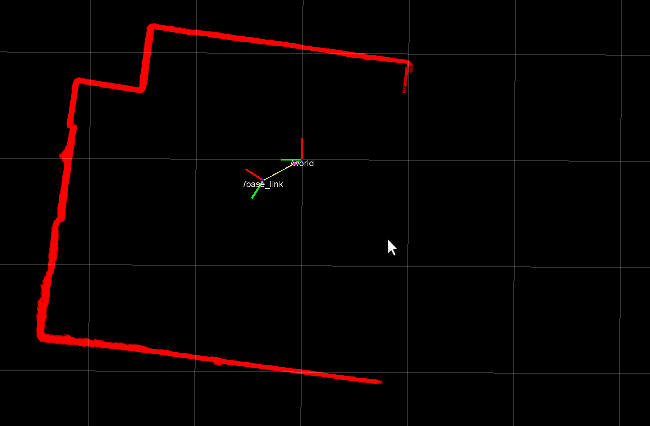

# Don't compute it twice

The example I am going to present will make some of you react like this:


I say this because, for some of you ,it will be absolutely obvious... in retrospective.

On the other hand, I have seen **this same code** being used in open source projects.

Projects with hundreds of Github stars missed this (apparently obvious) opportunity for optimization.

Have a look to: [Speed up improvement for laserOdometry and scanRegister (20%)](https://github.com/laboshinl/loam_velodyne/pull/20)

## 2D transforms

Let's consider this code:

```c++
double x1 = x*cos(ang) - y*sin(ang) + tx;
double y1 = x*sin(ang) + y*cos(ang) + ty;
```

People with a trained eye and a little of trigonometric background will immediately recognize the [affine transform of a 2D point], commonly used in computer graphics or robotics.

Don't you see anything we can do better? Of course:

```c++
const double Cos = cos(angle);
const double Sin = sin(angle);
double x1 = x*Cos - y*Sin + tx;
double y1 = x*Sin + y*Cos + ty;
```

The cost of trigonometric functions is relatively high and there is absolutely no reason to compute twice the same value.
The latter code will be 2x times faster then the former, because the cost of multiplication and sum is really low compared with `sin()` and `cos()`.

In general, if the number of potential angles you need to test is finite, consider to use look-up-table where you can store pre-computed values.

This is the case, for instance, of laser scan data, that needs to be converted from polar coordinates to cartesian ones.



A naive implementation would invoke trigonometric functions for each point (in the order of thousands per seconds).

```c++
// Conceptual operation (inefficient)
// Data is usually stored in a vector of distances
std::vector<double> scan_distance;
std::vector<Pos2D> cartesian_points;

cartesian_points.reserve( scan_distance.size() );

for(int i=0; i<scan_distance.size(); i++)
{
	const double dist = scan_distance[i];
	const double angle = angle_minimum + (angle_increment*i);
	double x = dist*cos(angle);
	double y = dist*sin(angle);
	cartesian_points.push_back( Pos2D(x,y) );
}
```

That is unecessary inefficient, because: 

 - **angle_minimum** and **angle_increment** are constants that never change.
 - the size of the **scan_distance** is constant too (not its content, of course).
 
 This is the perfect example where a LUT makes sense and can dramatically improve performance.
 
 ```c++
//------ To do only ONCE -------
std::vector<double> LUT_cos;
std::vector<double> LUT_sin;

for(int i=0; i<scan_distance.size(); i++)
{
	const double angle = angle_minimum + (angle_increment*i);
	LUT_cos.push_back( cos(angle) );
	LUT_sin.push_back( sin(angle) );
}

// ----- The efficient scan conversion ------
std::vector<double> scan_distance;
std::vector<Pos2D> cartesian_points;

cartesian_points.reserve( scan_distance.size() );

for(int i=0; i<scan_distance.size(); i++)
{
	const double dist = scan_distance[i];
	double x = dist*LUT_cos[i];
	double y = dist*LUT_sin[i];
	cartesian_points.push_back( Pos2D(x,y) );
}
```

# Lessons to take home

This is a simple example; what you should learn from it is that, whenever an operation is expensive to compute (SQL queries, stateless mathematical operations), you should consider to use a cached value and or to build a look-up-table.

But, as always, measure first, to be sure that the optimization is actually relevant ;)


