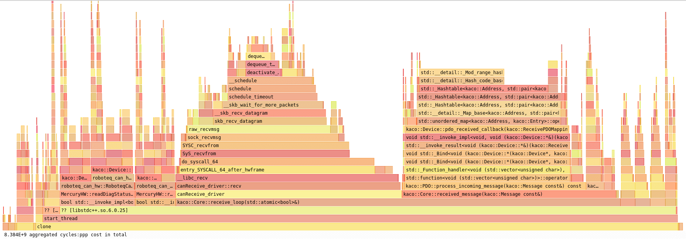

# Optimizing using an exotic associative container


Come on Michael, you are underestimating me ;)

# The problem

The last week, I decided to investigate one of the modules that was using a lot of CPU, or at least, more than I expected.

I am not going to bother you with the details, but it was a low-level hardware interface to control the motors of our robots.

I knew enough about this part of the software system, to believe that it was not supposed to keep an entire CPU core busy.

Needless to say, I used my best friend **Hotspost** to see where the CPU time was spent:



This looks a mess, doesn't it? Bear with me.

If you are new to [flamegraphs](http://www.brendangregg.com/flamegraphs.html), don't freak out. Simply, caller functions are at the bottom of the pyramid and, on top of them, there are  their callees functions.

What caught my attention was that 30% of the CPU is wasted in the method **std::unordered_map<>::operator[]**.


There is a big block on the right side, and then many multiple calls here and there in the code on the left one.

The problematic container looks more or less like this:

```C++
// simplified code
std::unordered_map<Address, Entry*> m_dictionary;

//where
struct Address{
    int16_t index;
    unt8_t subindex;
};
```

# The solution

I inspected the code and I found horrible things. Like this:

```C++
// simplified code
bool hasEntry(const Address& address) 
{
    return m_dictionary.count(address) != 0;
}

Value getEntry(const Address& address) 
{
    if( !hasEntry(address) {
        throw ...
    }
    Entry* = m_dictionary[address];
    // rest of the code
}
```


The correct way to do it is, instead:

```C++
// simplified code. Only one lookup
Value getEntry(const Address& address) 
{
    auto it = m_dictionary.find(address);
    if( it ==  m_dictionary.end() ) {
        throw ...
    }
    Entry* = it->second;
    // rest of the code
}
```

This change alone cuts by half the overhead of `std::unordered_map` observed in the flamegraph.

## Embrace caching

It is very important to note that once created, the dictionary is never changed at run-time.

This allows us, as mentioned in the picture, to optimize the large block on the right side using caching.

In fact, the map lookup is executed inside a callback that has access to the relevant address. But if the **[Address, Entry*]** pair never changes, why don't we directly store the `Entry*`?

As expected, this completely erase the overhead in that big block using 15% of the CPU.

If you haven't you may look at similar examples of caching [in one of my previous articles about 2D transformations](2d_transforms.md).

## Winning big with `boost::container_flat_map`

Using caching in the rest of the code would have been a pain. That is the typical example of "death by a 1000 papercuts".

Furthermore, there was something in the back of my head telling me that something was off.

Why does `std::hash<Address>` take so long? Is this, maybe,  **one of those rare cases** where I should not look at the big O() notation?

`std::unordered_map` lookup is O(1), that is a Good Thing, isn't it?

Shall we try some lateral thinking and use another container with O(logn) lookup complexity, but without the cost of the hash function?

 Drum roll, please and welcome [boost::container_flat_map](https://www.boost.org/doc/libs/1_74_0/doc/html/container/non_standard_containers.html#container.non_standard_containers.flat_xxx).
 
I am not going to repeat what the documentation explains about the implementation, which is mostly a normal ordered vector, similar to what I discuss [at the end of this article about std::map](dont_need_map.md).

The results surprised me: I haven't just "reduced" the overhead, it was completely gone. The cost of `flat_map<>::operator[]` was barely measurable.

Basically, just switching to `flat_map` solved the entire problem changing in one line of code!


