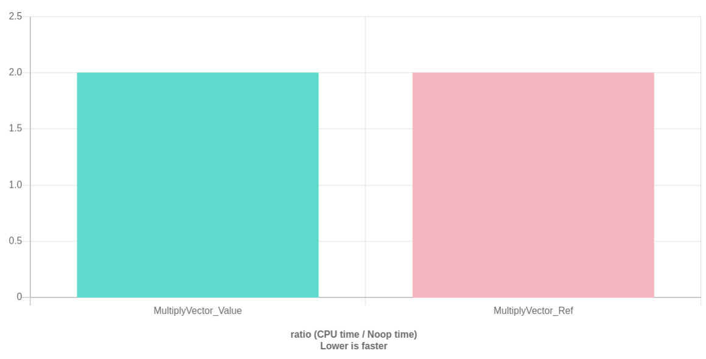

# Value semantic vs references

What I am going to say here is so trivial that probably any seasoned developer
knows it already.

Nevertheless, I keep seeing people doing stuff like this:

```C++
bool OpenFile(str::string filename);

void DrawPath(std::vector<Points> path);

Pose DetectFace(Image image);

Matrix3D Rotate(Matrix3D mat, AxisAngle axis_angle);

```

I made these functions up, but **I do see** code like this in production sometimes.

What do these functions have in common? You are passing the argument **by value**.

In other words, whenever you call one of these functions, you make a copy of the input in your scope
and pass the **copy** to the function.

<p align="center"></p>

Copies may, or may not, be an expensive operation, according to the size of the object or the fact
that it requires dynamic heap memory allocation or not.

In these examples, the objects that probably have a negligible overhead,
when passed by value, are `Matrix3D` and `AngleAxis`, because we may assume that they don't require
heap allocations.

But, even if the overhead is small, is there any reason to waste CPU cycle, if we can avoid it?

This is a better API:


```C++
bool OpenFile(const str::string& filename); // string_view is even better

void DrawPath(const std::vector<Points>& path);

Pose DetectFace(const Image& image);

Matrix3D Rotate(const Matrix3D& mat, const AxisAngle& axis_angle);

```

In the latter version, we are using what is called **"reference semantic"**.

You may use **C-style** (not-owning) pointers instead of references and get the same benefits, in terms of
performance, but here we are telling to the compiler that the arguments are:

- Constant. We won't change them on the callee side, nor inside the called function.
- Being a reference, the argument *refers* to an existing object. A raw pointer might have value `nullptr`.
- Not being a pointer, we are sure that we are not transferring the ownership of the object.

The cost can be dramatically different, as you may see here:

```C++
size_t GetSpaces_Value(std::string str)
{
    size_t spaces = 0;
    for(const char c: str){
        if( c == ' ') spaces++;
    }
    return spaces;
}

size_t GetSpaces_Ref(const std::string& str)
{
    size_t spaces = 0;
    for(const char c: str){
        if( c == ' ') spaces++;
    }
    return spaces;
}

const std::string LONG_STR("a long string that can't use Small String Optimization");

void PassStringByValue(benchmark::State& state) {
    for (auto _ : state) {
        size_t n = GetSpaces_Value(LONG_STR);
    }
}

void PassStringByRef(benchmark::State& state) {
    for (auto _ : state) {
        size_t n = GetSpaces_Ref(LONG_STR);
    }
}

//----------------------------------
size_t Sum_Value(std::vector<unsigned> vect)
{
    size_t sum = 0;
    for(unsigned val: vect) { sum += val; }
    return sum;
}

size_t Sum_Ref(const std::vector<unsigned>& vect)
{
    size_t sum = 0;
    for(unsigned val: vect) { sum += val; }
    return sum;
}

const std::vector<unsigned> vect_in = { 1, 2, 3, 4, 5 };

void PassVectorByValue(benchmark::State& state) {
    for (auto _ : state) {
        size_t n = Sum_Value(vect_in);
    }
}

void PassVectorByRef(benchmark::State& state) {
    for (auto _ : state) {
        size_t n = Sum_Ref(vect_in);
        benchmark::DoNotOptimize(n);
    }
}

```

<p align="center"></p>

Clearly, passing by reference wins hands down.

## Exceptions to the rule

> "That is cool Davide, I will use `const&` everywhere".

Let's have a look to another example, first.

```C++
struct Vector3D{
    double x;
    double y;
    double z;
};

Vector3D MultiplyByTwo_Value(Vector3D p){
    return { p.x*2, p.y*2, p.z*2 };
}

Vector3D MultiplyByTwo_Ref(const Vector3D& p){
    return { p.x*2, p.y*2, p.z*2 };
}

void MultiplyVector_Value(benchmark::State& state) {
    Vector3D in = {1,2,3};
    for (auto _ : state) {
        Vector3D out = MultiplyByTwo_Value(in);
    }
}

void MultiplyVector_Ref(benchmark::State& state) {
    Vector3D in = {1,2,3};
    for (auto _ : state) {
        Vector3D out = MultiplyByTwo_Ref(in);
    }
}
```

<p align="center"></p>

Interesting! Using `const&` has no benefit at all, this time.

When you copy an object that doesn't require heap allocation and is smaller than a few dozens of bytes,
you won't notice any benefit passing them by reference.

On the other hand, it will never be slower so, if you are in doubt, using `const&` is always a "safe bet". While passing primitive types by const references can be shown to generate an extra instruction (see https://godbolt.org/z/-rusab). That gets optimized out when compiling with `-O3`.

My rule of thumb is: never pass by reference any argument with size 8 bytes or less (integers, doubles, chars, long, etc.).

Since we know for sure that there is 0% benefit, writing something like this **makes no sense** and it is "ugly":

```C++
void YouAreTryingTooHardDude(const int& a, const double& b);
```
