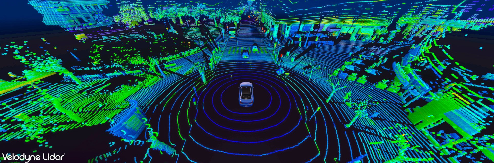

# Do you actually need to use std::map?

`std::map` is one of the most known data structures in C++, the default associative container for most of us, but its popularity has been decreasing over the years.

Associative containers are used when you have **pairs of key/value** and you want to find a value given its key.

But, because of the way the nodes of the [red-black tree](https://en.wikipedia.org/wiki/Red%E2%80%93black_tree) are created, `std::map` is
not much different than an `std::list`, i.e. an unwelcome memory allocation during insertion and a very cache-unfriendly memory layout.

Before selecting this data structure, ask yourself these questions:

- do I need all the pairs to be **ordered** by their keys?
- do I need to iterate often through all the items of the container?

If the answer to the first question is "no", you may want to switch by default to `std::unordered_map`. 

In all my benchmarks, this was always a win. Maybe I was lucky and maybe there are situations in which `std::map` would perform better, but I haven't found those cases yet.

If you answer "yes" to the second question... this will be interesting.

Sit on my lap, my child, and join my optimization adventures.

## Optimizing the Velodyne driver

This is a Pull Request I am particularly proud of:  

[Avoid unnecessary computation in RawData::unpack](https://github.com/ros-drivers/velodyne/pull/194)

To understand how a small change can make a huge difference, think about what this driver is doing.

<p align="center"></p>

The Velodyne is a sensor that measures hundreds of thousands of points per seconds (distance from obstacles); it is the most important sensor in most autonomous cars.

The Velodyne driver converts measurements in polar coordinates to 3D cartesian coordinates (the so-called "PointCloud").

I profiled the Velodyne driver using **Hotspot** and, surprise surprise, I found that something related to `std::map::operator[]` was using a lot of CPU.

So I explored the code and I found this:

```C++
 std::map<int, LaserCorrection> laser_corrections;
```
 `LaserCorrection`contains some calibration information that was needed to adjust the measurements.
 
 The `int` key of the map is a number in the range  [0, N-1], where N could be 16, 32 or 64. Maybe one day it will reach 128!
 
 Furthermore `laser_corrections` was created once (no further insertions)
 and used over and over again in a loop like this:
 
```C++
 // code simplified
 for (int i = 0; i < BLOCKS_PER_PACKET; i++) {
    //some code
    for (int j = 0; j < NUM_SCANS; j++) 
    {   
        int laser_number = // omitted for simplicity
        const LaserCorrection &corrections = laser_corrections[laser_number];
        // some code
    }
 }
```

<p align="center"></p>

Indeed, behind this innocent line of code:

      laser_corrections[laser_number];

There is a search in a red-black tree!

Remember: the index is **not** a random number, its value is always between 0 and N-1, where N is very small.

So, I proposed this change and you can not imagine what happened next:

```C++
 std::vector<LaserCorrection> laser_corrections;
```

<p align="center"></p>

Summarizing, there wasn't any need for an associative container, because the position in the vector itself (the index) is working just fine.

I don't blame in any way the developers of the Velodyne driver, because changes like these make sense only in retrospective:  until you profile your application and do some actual profiling, it is hard to see how changes like this may influence performance.

When you think that the rest of the function does **a lot** of mathematical operations, you can understand how counter-intuitive it is that the actual bottleneck was a tiny `std::map`.

## Going a step further: vector of pairs

This example was quite "extreme", because of its very convenient integer key, a small number between 0 and N.

Nevertheless, in my code I use often a structure like this, instead of a "real" associative container:

```C++
std::vector< std::pair<KeyType, ValueType> > my_map;
```

This is the best data structure if what you need to **iterate frequently over all the elements**.

Most of the times, you can not beat it!

> "But Davide, I need to have those elements ordered, that is the reason why I used `std::map`"!

Well, if you need them ordered... order them!

```C++
std::sort( my_map.begin(), my_map.end() ) ;
```
> "But Davide, sometimes I need to search an element in my map"

In that case, you can find your element by its key searching in an **ordered** vector with the function 
[std::lower_bound](http://www.cplusplus.com/reference/algorithm/lower_bound/).

The complexity of lower_bound/upper_bound is **O(log n)**, the same as `std::map`, but iteration through all the elements is much, much faster.

## Summarizing

- Think about the way you want to access your data.
- Ask yourself if you have frequent or infrequent insertion/deletion.
- Do not underestimate the cost of an associative container.
- Use `std::unordered_map` by default... or `std::vector`, of course !
