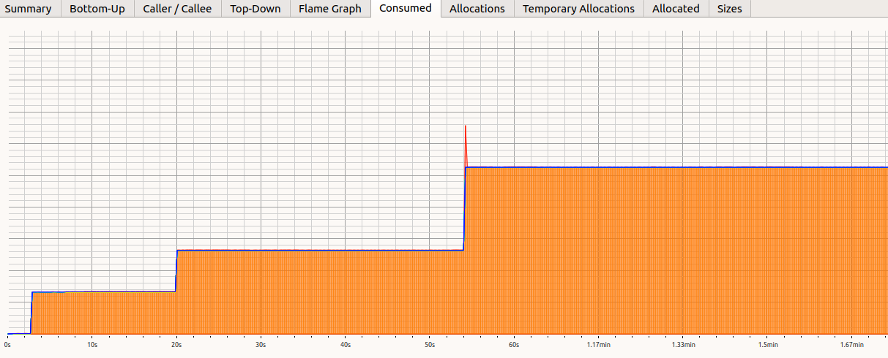

# Vectors are awesome...

`std::vector<>`s have a huge advantage when compared to other data structures:
their elements are packed in memory one next to the other.

We might have a long discussion about how this may affect performance, based on how memory
works in modern processors.

If you want to know more about it, just Google "C++ cache aware programming". For instance:

- [CPU Caches and why you Care](https://www.aristeia.com/TalkNotes/codedive-CPUCachesHandouts.pdf)
- [Writing cache friendly C++ (video)](https://www.youtube.com/watch?v=Nz9SiF0QVKY) 

Iterating through all the elements of a vector is very fast and they work really really well when we have to
append or remove an element from the back of the structure.

# ... when you use `reserve`

We need to understand how vectors work under the hood.
When you push an element into an empty or full vector, we need to:

- allocate a new block of memory that is larger.
- move all the elements we have already stored in the previous block into the new one. 

Both these operations are expensive and we want to avoid them as much as possible, if you can, 
sometimes you just accept things the way they are.

The size of the new block is **2X the capacity**. Therefore, if you have 
a vector where both `size()` and  `capacity()` are 100 elements and you `push_back()` element 101th,
the block of memory (and the capacity) will jump to 200. 

To prevent these allocations, that may happen multiple times, we can **reserve** the capacity that 
we know (or believe) the vector needs.

Let's have a look to a micro-benchmark.

```C++
static void NoReserve(benchmark::State& state) 
{
  for (auto _ : state) {
    // create a vector and add 100 elements
    std::vector<size_t> v;
    for(size_t i=0; i<100; i++){  v.push_back(i);  }
  }
}

static void WithReserve(benchmark::State& state) 
{
  for (auto _ : state) {
    // create a vector and add 100 elements, but reserve first
    std::vector<size_t> v;
    v.reserve(100);
    for(size_t i=0; i<100; i++){  v.push_back(i);  }
  }
}


static void ObsessiveRecycling(benchmark::State& state) {
  // create the vector only once
  std::vector<size_t> v;
  for (auto _ : state) {
    // clear it. Capacity is still 100+ from previous run
    v.clear();
    for(size_t i=0; i<100; i++){  v.push_back(i);  }
  }
}
```


Look at the difference! And these are only 100 elements.

The number of elements influence the final performance gain a lot, but one thing is sure: it **will** be faster.

Note also as the `ObsessiveRecycling` brings a performance gain that is probably visible for small vectors, but negligible with bigger ones.

Don't take me wrong, though: `ObsessiveRecycling` will always be faster, even if according to the size of the object you are storing
you may or may not notice that difference.


## Recognizing a vector at first sight

This is the amount of memory an applications of mine was using over time (image obtained with **Heaptrack**):



Look at that! Something is doubling the amount of memory it is using by a factor of two every few seconds...

I wonder what it could be? A vector, of course, because other data structures would have a more "linear" growth.

That, by the way, **is a bug in the code that was found thanks to memory profiling**: that vector was not supposed to grow at all.


